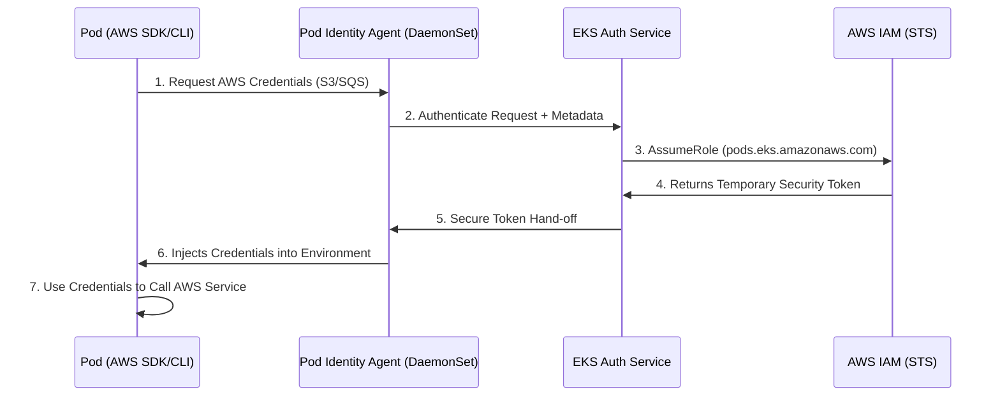

# EKS Pod Identity: The Modern Way to Grant AWS Permissions 🛡️☁️

**EKS Pod Identity** is the next generation of IAM for Kubernetes (EKS). It allows your Pods to securely call AWS services (like S3, DynamoDB, or SQS) without managing access keys or complex OIDC providers like IRSA.

---

## 1. Why Pod Identity? (Vs. IRSA) 🔄

For years, we used **IRSA** (IAM Roles for Service Accounts). While secure, it required:
- Creating an OIDC provider for every cluster.
- Annotating ServiceAccounts with the IAM Role ARN.
- Complex Trust Policies that included the OIDC provider's URL.

**Pod Identity** simplifies this by using an **EKS Pod Identity Agent** (an add-on). You no longer need to manage OIDC URLs or annotate ServiceAccounts!

---

## 2. High-Level Flow: How It Works 🔄

The magic of EKS Pod Identity lies in how it intercepts traffic and swaps security tokens behind the scenes.

### 2.1 Visual Flow


### 2.2 Step-by-Step Breakdown
1.  **Pod Startup**: Your application starts up and tries to call an AWS service using the SDK or CLI.
2.  **Intercept**: The **AWS SDK** detects environment variables injected by the **Pod Identity Agent**.
3.  **Local Request**: The SDK makes a request to the Agent running on the **local worker node**.
4.  **Verification**: The Agent talks to the **EKS Auth Service** to verify the Pod's identity (Namespace + ServiceAccount).
5.  **Role Assumption**: The EKS Auth Service calls **AWS STS** to assume the IAM Role associated with that ServiceAccount.
6.  **Token Delivery**: Temporary credentials (Access Key, Secret Key, Session Token) are passed back to the Pod.
7.  **Execution**: The Pod uses these credentials to talk directly to S3, DynamoDB, etc.

---

## 3. Deep-Dive: The EKS Pod Identity Agent 🤖

The **EKS Pod Identity Agent** is the bridge between your Kubernetes pods and AWS IAM. Without it, Pod Identity simply won't work.

### 2.1 What is it?
It is a **DaemonSet** (an Amazon EKS add-on) that runs on every worker node in your cluster. It listens for requests from the AWS SDK inside your pods and handles the "heavy lifting" of fetching temporary IAM credentials.

### 2.2 Why do we need it?
In the old IRSA method, pods had to talk directly to an OIDC endpoint on the internet.
- **The Agent's Role**: It intercepts calls to the AWS metadata service and replaces them with secure, short-lived tokens.
- **Security**: It ensures that credentials are never stored on disk and are only available to the specific pod that requested them.

### 2.3 Where and When do we need it?
- **Where**: It must be installed on **every EKS cluster** where you want to use the Pod Identity feature. It runs on both EC2 nodes and Fargate (where it's managed by AWS).
- **When**: You need it as soon as you want to move away from managing OIDC providers and annotations. It should be one of the first add-ons you install after cluster creation.

### 2.4 How to install it? 🛠️

You have two primary ways to install the agent:

#### **Method A: Using AWS CLI (Recommended for DevOps)**
```bash
# Install the add-on
aws eks create-addon \
  --cluster-name my-eks-cluster \
  --addon-name eks-pod-identity-agent \
  --addon-version v1.0.0-eksbuild.1  # Tip: Use 'describe-addon-versions' for latest
```

#### **Method B: Using AWS Management Console**
1. Navigate to the **EKS Console** -> Select your **Cluster**.
2. Go to the **Add-ons** tab -> Click **Get more add-ons**.
3. Search for **EKS Pod Identity Agent**.
4. Select the version and click **Install**.

---

## 4. The Identity: ServiceAccounts & AWS CLI/SDK 🔑

In Kubernetes, a **ServiceAccount** is the "User Identity" for a Pod. When using EKS Pod Identity, the ServiceAccount becomes the link between the Pod and your IAM Role.

### 3.1 Why do we use them?
- **Isolation**: Instead of giving the entire Node permissions to AWS (which is dangerous), we give permissions only to specific ServiceAccounts.
- **Auditability**: AWS CloudTrail logs will show exactly which ServiceAccount (and thus which Pod) made a specific API call.
- **Zero Secrets**: You don't need to mount `~/.aws/credentials` files. The identity is provided by the cluster.

### 3.2 When to use them?
- **Always**: Every time a Pod needs to talk to an AWS service (S3, SQS, etc.), it should have its own dedicated ServiceAccount.
- **Cross-Account Access**: When a Pod in one AWS account needs to access resources in another account.

### 3.3 How it works with AWS CLI/SDK? ⚙️
The magic happens automatically if you are using a modern version of the AWS SDK or AWS CLI (version 2.x).

1.  **The Environment**: The Pod Identity Agent injects two environment variables into your Pod:
    - `AWS_CONTAINER_CREDENTIALS_FULL_URI`
    - `AWS_CONTAINER_AUTHORIZATION_TOKEN`
2.  **The Discovery**: When your code runs `aws s3 ls` or `s3.listObjects()`, the AWS SDK automatically looks for these variables first.
3.  **The Fetch**: The SDK talks to the **Pod Identity Agent** on the local node to get a temporary credential.
4.  **The Result**: Your code works exactly the same way it does on your laptop, but without you ever providing a password or key!

**Example Pod Spec Snippet:**
```yaml
apiVersion: v1
kind: Pod
metadata:
  name: aws-cli-pod
spec:
  # This is the "Identity" we mapped to the IAM Role
  serviceAccountName: s3-reader-sa 
  containers:
    - name: aws-cli
      image: amazon/aws-cli:latest
      command: ["aws", "s3", "ls"]
```

---

## 5. The Mapping: EKS Pod Identity Association 🔗

The **Pod Identity Association** is the "Management Bridge" that tells AWS which Kubernetes workload is allowed to use which IAM Role.

### 4.1 Why do we use it?
- **Decoupling**: In the old IRSA method, you had to hardcode IAM Role ARNs inside your Kubernetes `ServiceAccount` YAML. With Associations, your K8s YAML remains "clean".
- **Centralized Control**: Security teams can manage permissions in the AWS Console or via Terraform without ever touching the Kubernetes manifests.
- **Dynamic Mapping**: You can change the IAM Role for a ServiceAccount instantly without restarting or redeploying the Pods.
- **Simplified Operations**: You don't need to manage OIDC providers or update annotations every time you rotate a role.

### 4.2 When to use it?
- **Workflow Security**: Use it when you have a microservice in a specific namespace that requires permissions for S3, SQS, etc.
- **Environment Separation**: When you want the *same* ServiceAccount name in `dev` and `prod` namespaces to have *different* IAM roles. You simply create two different associations.

### 4.3 Where is it defined?
Unlike ServiceAccounts (which are in K8s), the Association is **defined in AWS**.
- It is a cluster-level setting in the EKS Control Plane.
- It is stored in the AWS EKS API, not in the etcd of your cluster.

### 4.4 How to use it? 🛠️

You create an association using the AWS CLI, Console, or Infrastructure-as-Code (Terraform/CloudFormation).

#### **Example: Mapping a Backend SA to an S3 Role**
```bash
aws eks create-pod-identity-association \
  --cluster-name my-cluster \
  --namespace backend \
  --service-account backend-sa \
  --role-arn arn:aws:iam::123456789012:role/s3-access-role
```

**Key Parameters:**
1.  **`namespace`**: The K8s namespace where your pod is running.
2.  **`service-account`**: The name of the ServiceAccount assigned to the pod.
3.  **`role-arn`**: The ARN of the IAM role with the `pods.eks.amazonaws.com` trust policy.

---

## 6. Technical Setup: IAM Role & Trust Policy ⛓️

To complete the access chain, you must configure the IAM Role and create the mapping in EKS.

### 6.1 The IAM Trust Policy (The "How")
The IAM Role needs a specific trust relationship that allows the **Pod Identity service** (via the agent) to assume the role. This is the exact JSON required:

```json
{
    "Version": "2012-10-17",
    "Statement": [
        {
            "Effect": "Allow",
            "Principal": {
                "Service": "pods.eks.amazonaws.com"
            },
            "Action": [
                "sts:AssumeRole",
                "sts:TagSession"
            ]
        }
    ]
}
```

### 6.2 The Pod Identity Association (The "Review")
This is the final link. It maps an IAM Role to a specific Kubernetes **Namespace** and **ServiceAccount**. 
- **Effect**: Any pod using that ServiceAccount in that Namespace will automatically receive the IAM permissions.
- **Advantage**: Zero code changes; the AWS SDK discovers the credentials automatically.

---

## 7. Real-World Examples: Accessing AWS Services 🚀

### 7.1 Scenario: Reading Data from S3 📦
**The Goal:** A backend pod needs to list files in an S3 bucket.

1.  **IAM Policy:**
    ```json
    {
        "Version": "2012-10-17",
        "Statement": [{
            "Effect": "Allow",
            "Action": ["s3:ListBucket", "s3:GetObject"],
            "Resource": ["arn:aws:s3:::my-app-data-bucket", "arn:aws:s3:::my-app-data-bucket/*"]
        }]
    }
    ```
2.  **Pod Identity Association (CLI):**
    ```bash
    aws eks create-pod-identity-association \
      --cluster-name my-eks-cluster \
      --namespace backend \
      --service-account s3-reader-sa \
      --role-arn arn:aws:iam::123456789012:role/eks-s3-reader-role
    ```

---

### 7.2 Scenario: Saving User Data in DynamoDB ⚡
**The Goal:** A microservice needs to put items into a DynamoDB table.

1.  **IAM Policy:**
    ```json
    {
        "Version": "2012-10-17",
        "Statement": [{
            "Effect": "Allow",
            "Action": ["dynamodb:PutItem", "dynamodb:GetItem", "dynamodb:UpdateItem"],
            "Resource": "arn:aws:dynamodb:us-east-1:123456789012:table/UserRecords"
        }]
    }
    ```
2.  **Pod Usage:** The application code simply uses the AWS SDK. The SDK automatically detects the credentials provided by the Pod Identity Agent.

---

### 7.3 Scenario: Processing Tasks via SQS 📩
**The Goal:** A worker pod needs to receive and delete messages from a queue.

1.  **IAM Policy:**
    ```json
    {
        "Version": "2012-10-17",
        "Statement": [{
            "Effect": "Allow",
            "Action": ["sqs:ReceiveMessage", "sqs:DeleteMessage", "sqs:GetQueueAttributes"],
            "Resource": "arn:aws:sqs:us-east-1:123456789012:ProcessingQueue"
        }]
    }
    ```
2.  **Implementation:** Map the IAM Role to the ServiceAccount using the Pod Identity Association.

---

## 8. Best Practices for DevOps Engineers 💡

1.  **Least Privilege:** Never use `Resource: "*"`. Be specific with ARNs for buckets, tables, and queues.
2.  **ServiceAccount Isolation:** Use one ServiceAccount per microservice. Do not share one "Global" ServiceAccount.
3.  **Auto-Rotation:** Pod Identity automatically rotates credentials every few hours. This is why it is more secure than using static Access Keys.
4.  **No Annotations Needed:** Unlike IRSA, you don't need to put `eks.amazonaws.com/role-arn` on your ServiceAccount. The association handles it at the cluster level.

---

## 10. Summary Cheat-Sheet

| Step | Component | Action |
| :--- | :--- | :--- |
| **1** | **IAM Role** | Create with `pods.eks.amazonaws.com` Trust Policy. |
| **2** | **Permissions** | Attach S3/DynamoDB/SQS policies to the Role. |
| **3** | **Association** | Map Namespace + ServiceAccount to IAM Role. |
| **4** | **Deployment** | Use the specified ServiceAccount in your `pod.spec`. |
