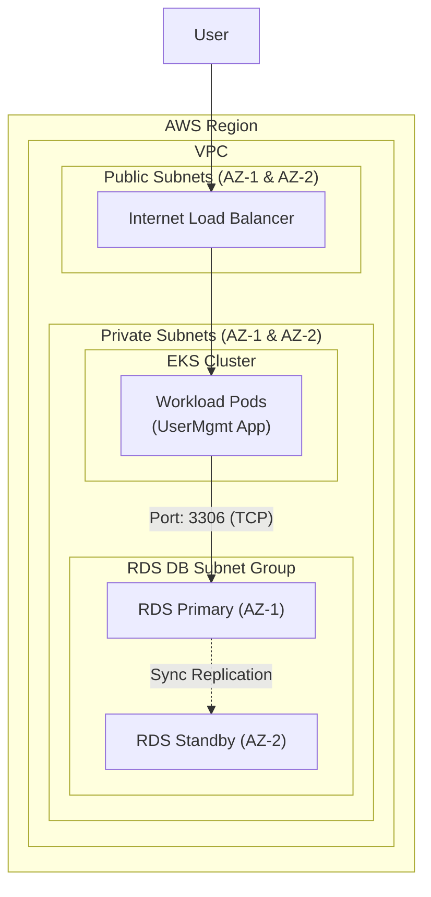

# AWS RDS vs. Containers: The Production Database Strategy 🗄️☁️⚖️

When deploying stateful applications to EKS, you face a critical decision: **Should I run my database as a container in EKS, or use a managed service like AWS RDS?** In this guide, we dive deep into why RDS is the industry standard for production workloads.

---

## 1. Advantages of Using AWS RDS 🚀🌟

Using AWS RDS provides several enterprise-grade features that are difficult and time-consuming to set up manually in a containerized environment.

### 1.1 Read Replicas (Horizontal Scaling) 📈
- **What it is**: RDS allows you to create one or more "Read Replicas" of your primary database.
- **Why it's an advantage**: You can offload read-heavy traffic (like reporting or dashboard queries) to the replicas, keeping the primary instance fast for writes. In EKS, setting up MySQL Read Replicas manually requires complex configuration and state management.

### 1.2 Security and Compliance 🛡️🔐
- **IAM Database Authentication**: You can manage database access using AWS IAM users and roles instead of managing passwords inside the DB.
- **KMS Encryption**: One-click encryption at rest using AWS Key Management Service (KMS).
- **VPC Isolation**: RDS runs in its own private subnet, and you control traffic using Security Groups, just like any other AWS resource.

### 1.3 Automated Backup and Point-in-Time Recovery (PITR) ⏪📸
- **Automated Snapshots**: RDS automatically backs up your volume and transaction logs.
- **Point-in-Time Recovery**: You can restore your database to **any second** during your retention period (up to 35 days). This is the ultimate "Undo" button for accidental data deletion.

### 1.4 Performance Monitoring (Insight) 📊👀
- **Enhanced Monitoring**: Provides over 50 metrics (CPU, Memory, I/O) at the OS level every second.
- **Performance Insights**: A visual dashboard that helps you find the exact SQL query that is slowing down your application.

### 1.5 Vertical Scaling with Zero Downtime ⚡🔝
- Need more RAM? Just change the instance type (e.g., from `t3.medium` to `r5.large`). RDS handles the migration and cutover.

---

## 2. Managed vs. Self-Managed: The "Heavy Lifting" 🏋️‍♂️

Running a database is more than just starting a process. It involves ongoing maintenance that can be complex and error-prone.

### 2.1 The RDS Advantage (Managed)
AWS RDS handles the **"Undifferentiated Heavy Lifting"**:
*   **Automated Backups**: Snapshots are taken daily with point-in-time recovery.
*   **Patching**: security and OS updates are handled automatically during a maintenance window.
*   **Monitoring**: Integrated with CloudWatch and Enhanced Monitoring out of the box.

### 2.2 The Container Challenge (Self-Managed)
In EKS, you are responsible for:
*   Configuring backup scripts and storing them in S3.
*   Manually upgrading the DB version and ensuring the data volume is compatible.
*   Monitoring the container health AND the storage health.

---

## 3. High Availability: Multi-AZ vs. Replication 🌐💫

In a distributed system, your database must survive a data center (Availability Zone) failure.

*   **RDS Multi-AZ**: With one click, AWS creates a synchronous standby in a different AZ. If the primary fails, RDS performs an automatic DNS failover in < 60 seconds. **No manual intervention needed.**
*   **Containers in EKS**: You must manage **StatefulSets**, Headless Services, and complex replication logic (Master-Slave). If a node fails, Kubernetes must detach the EBS volume and re-attach it to a new node, which can be slow and brittle.

---

## 4. EKS & RDS Network Design 🌐🛰️🏗️

Connecting an EKS workload to an RDS database requires a secure and well-architected network design within your AWS VPC.

### 4.1 The Architecture
For production, we follow the **"Private-First"** principle:
1.  **VPC**: A dedicated Virtual Private Cloud.
2.  **Private Subnets**: Both EKS worker nodes and RDS instances reside here. They are NOT accessible from the internet.
3.  **DB Subnet Group**: A collection of private subnets in different AZs where RDS can launch instances.

### 4.2 Security Group Connectivity 🛡️🔗
We use "Security Group Referencing" to allow traffic without hardcoding IP addresses:
*   **App Security Group (EKS Nodes)**: Attached to your worker nodes.
*   **DB Security Group (RDS)**: Attached to your RDS instance.
*   **Rule**: The DB Security Group allows **Inbound TCP on Port 3306** (MySQL) where the Source is the **App Security Group ID**.

### 4.3 Visual Design

---

## 5. Storage Performance and Durability 🚀🛡️

Databases are highly sensitive to Disk I/O (Input/Output).

*   **RDS**: Offers provisioned IOPS (PIOPS) and optimized hardware specifically tuned for database workloads.
*   **EKS/EBS**: While EBS is great, the overhead of the Kubernetes storage layer (CSI Driver) and network-attached storage latency can impact high-throughput databases.

---

## 5. Why not just use EBS for Containers? (The Storage Trap) 🪤

You might think: *"I already have EBS for persistence, why pay extra for RDS?"* Here is why EBS alone isn't enough for a production database:

### 5.1 The Single-AZ Anchor ⚓
**EBS volumes are locked to a single Availability Zone (AZ).**
- If your DB pod is in `us-east-1a` and that AZ goes down, your data is effectively "trapped." You cannot simply attach that volume to a node in `us-east-1b`.
- **RDS Multi-AZ** replicates data synchronously across AZs, so if one AZ fails, your database just keeps running in the other.

### 5.2 Block-Level vs. DB-Aware Backups 📸
- **EBS Snapshots**: These are block-level backups. They don't know what a "Transaction" is. If you take a snapshot while a heavy write is happening, your restored database might have corrupted tables.
- **RDS Backups**: These are database-aware. RDS ensures the database is in a consistent state before backing up and provides **Point-In-Time Recovery (PITR)**—allowing you to restore your database to a specific second in the past (e.g., *"Take me back to 10:05:22 AM before the bad query ran"*).

### 5.3 Management of the "Engine" 🚂
- With EBS, **YOU** are the Database Administrator (DBA). You have to tune the OS, configure the MySQL engine, manage logs, and handle rotation.
- With RDS, **AWS** is the DBA. They tune the underlying hardware and engine for maximum performance, leaving you to only worry about your schemas and queries.

---

## 6. Comparison Summary: RDS vs. Container + EBS 📊

| Feature | AWS RDS (Managed) | DB as Container (EKS) |
| :--- | :--- | :--- |
| **Setup Speed** | Minutes (AWS Console/Terraform) | Hours (Manifests + PVCs + LB) |
| **Backup/Recovery** | Native & Automated | Scripted & Manual |
| **Scaling** | Vertical/Horizontal (Easy) | Complex (StatefulSet scaling) |
| **Security** | AWS-managed encryption & IAM | Manual encryption & RBAC |
| **Failover** | Auto (Multi-AZ) | Manual or complex automation |

---

## 7. Conclusion: "Pets vs. Cattle" 🐈🐄

*   **Cattle (Pods)**: We treat app pods like cattle—if they die, we don't care, we just start a new one.
*   **Pets (Databases)**: Data is a "Pet." It is unique, irreducible, and critical. 

> [!IMPORTANT]
> **Production Recommendation**: Use **AWS RDS** for your primary data store. It allows your DevOps team to focus on building features rather than debugging database replication at 3 AM.

---

### Next Steps 🚀
Now that we understand the "Why," we will proceed to:
1.  Create an AWS RDS Instance.
2.  Configure Security Groups for EKS-to-RDS communication.
3.  Connect our User Management App to the RDS endpoint.
